# Project Management API

API backend para gerenciamento de projetos com upload e download de arquivos `.zip`, controle de usuários e armazenamento em blob storage.

⚠️ **Código privado**
Este sistema foi desenvolvido para uma startup e o código fonte não pode ser divulgado publicamente por acordo de confidencialidade (NDA). Abaixo estão documentadas a arquitetura e as funcionalidades do sistema.

---

# Tecnologias utilizadas

- TypeScript
- Node.js
- Fastify / Express
- PostgreSQL
- Prisma ORM
- Blob Storage (S3 compatible)

---

# Objetivo do projeto

Criar uma API para permitir que usuários da plataforma possam:

- criar projetos
- enviar arquivos compactados (`.zip`)
- baixar arquivos posteriormente
- gerenciar seus próprios projetos
- permitir que administradores tenham controle global do sistema

O foco do backend foi **organização de dados, segurança de acesso e gerenciamento de arquivos**.

---

# Funcionalidades

## Autenticação e controle de acesso

O sistema possui separação de permissões entre:

- **Usuário**
- **Administrador**

Usuários acessam apenas seus próprios projetos, enquanto administradores possuem acesso completo ao sistema.

---

## Gerenciamento de projetos

A API permite:

- criação de projetos
- listagem de projetos
- visualização de detalhes
- exclusão de projetos

Cada projeto pode possuir arquivos associados.

---

## Upload de arquivos

Usuários podem enviar arquivos `.zip`, que são armazenados em um serviço de **blob storage compatível com S3**.

Fluxo simplificado:

```
Client
  ↓

API
  ↓

Validação do arquivo
  ↓

Upload para Blob Storage

  ↓
Registro no banco de dados

```

# Admin Routes

## create new project

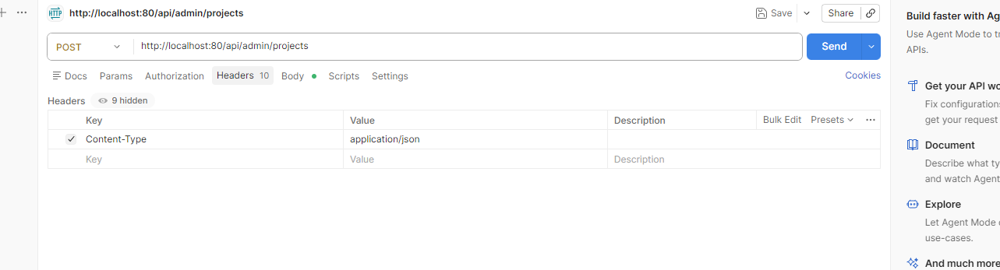
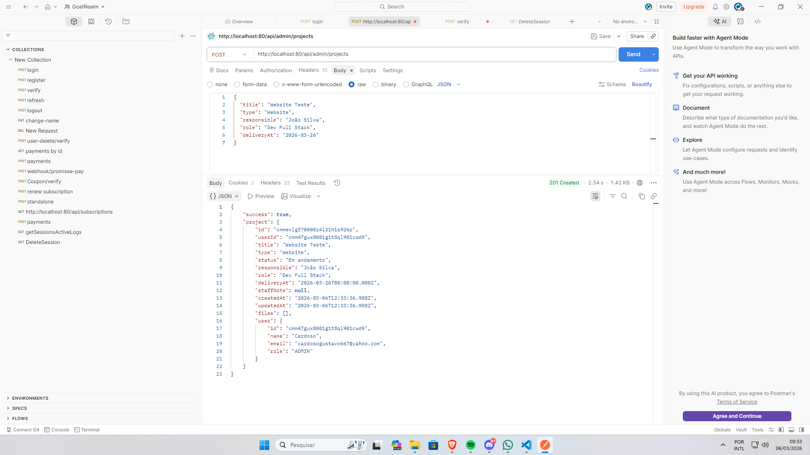

## List Projects

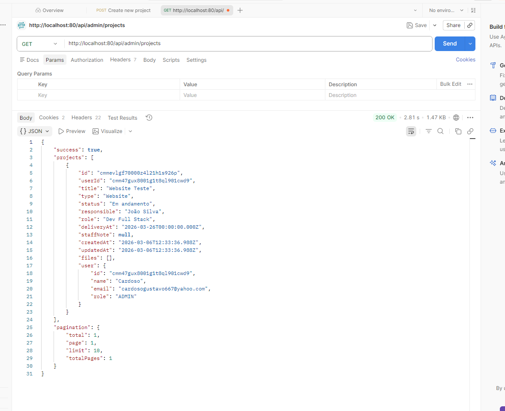

## buscar projeto por ID

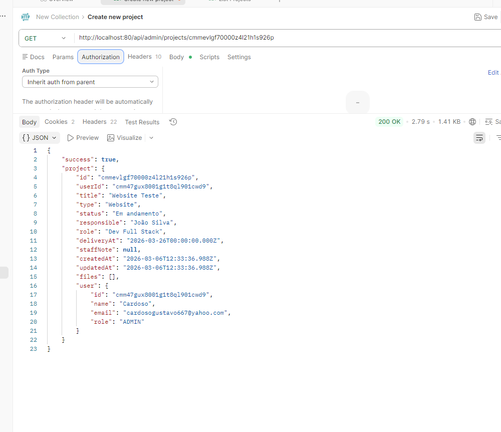

## Atualizar Projeto

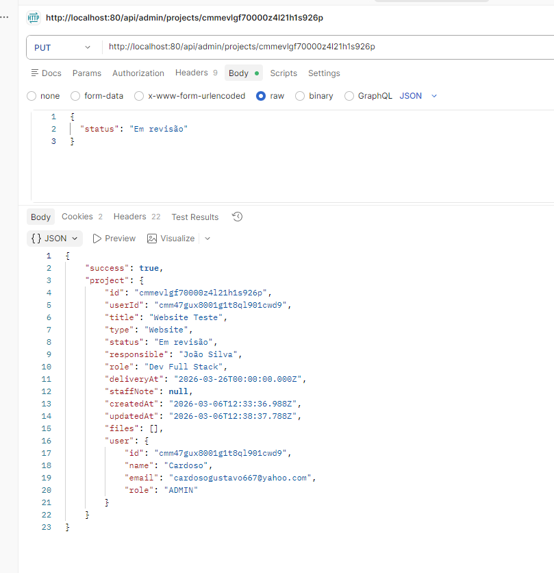

## Upload .zip

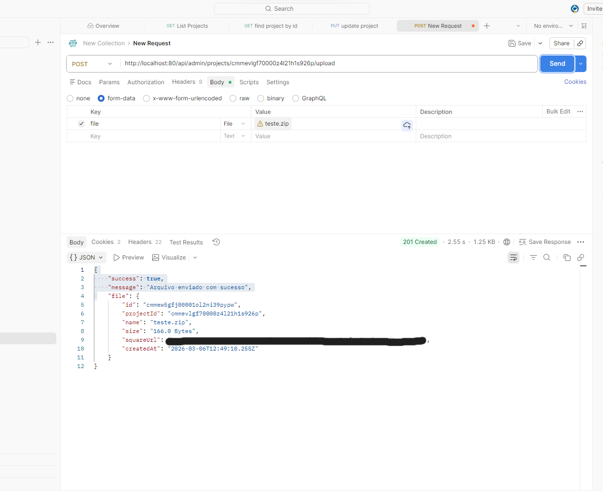
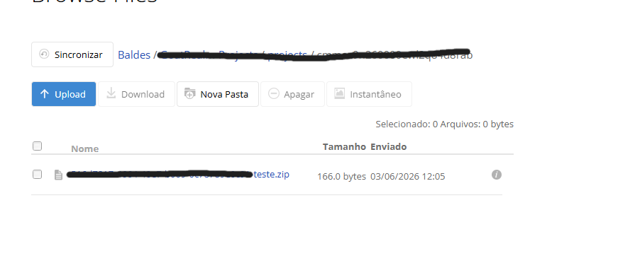
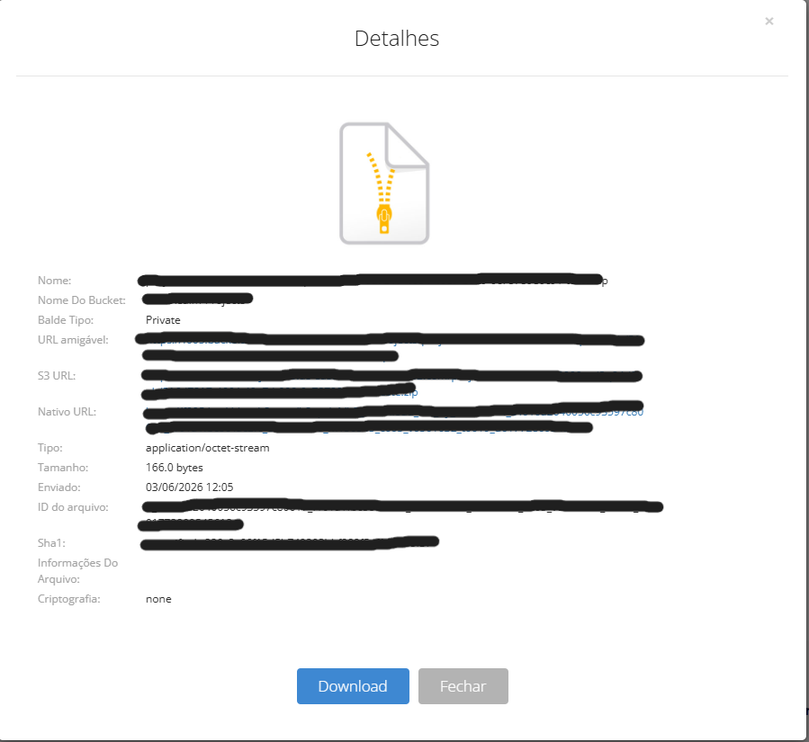

## rota para admin fazer download de projeto

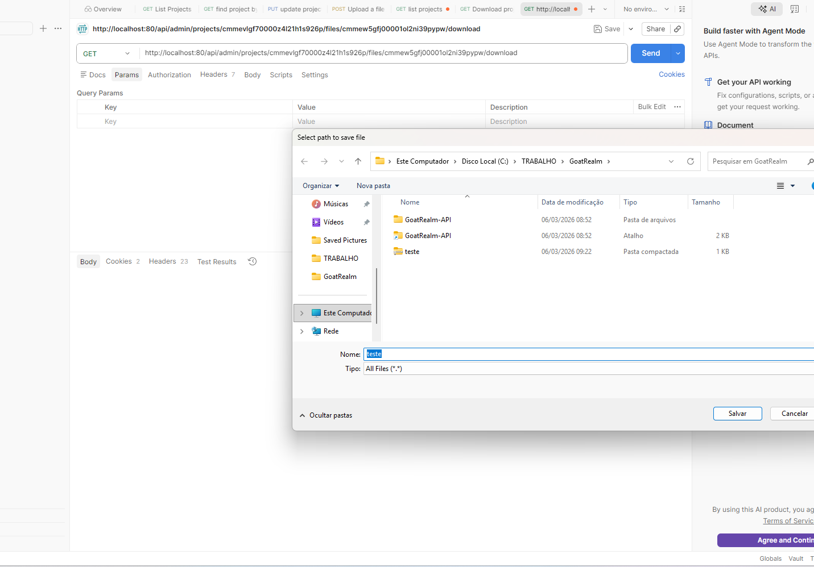

## Delete Project

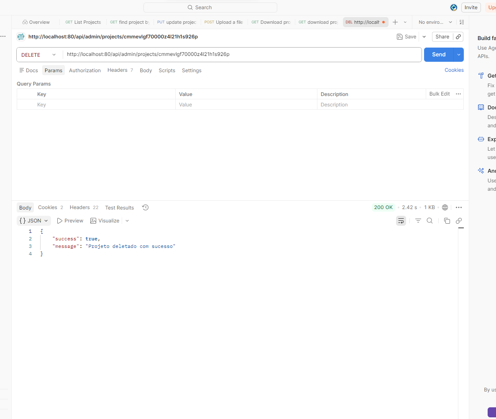

## delete from blob

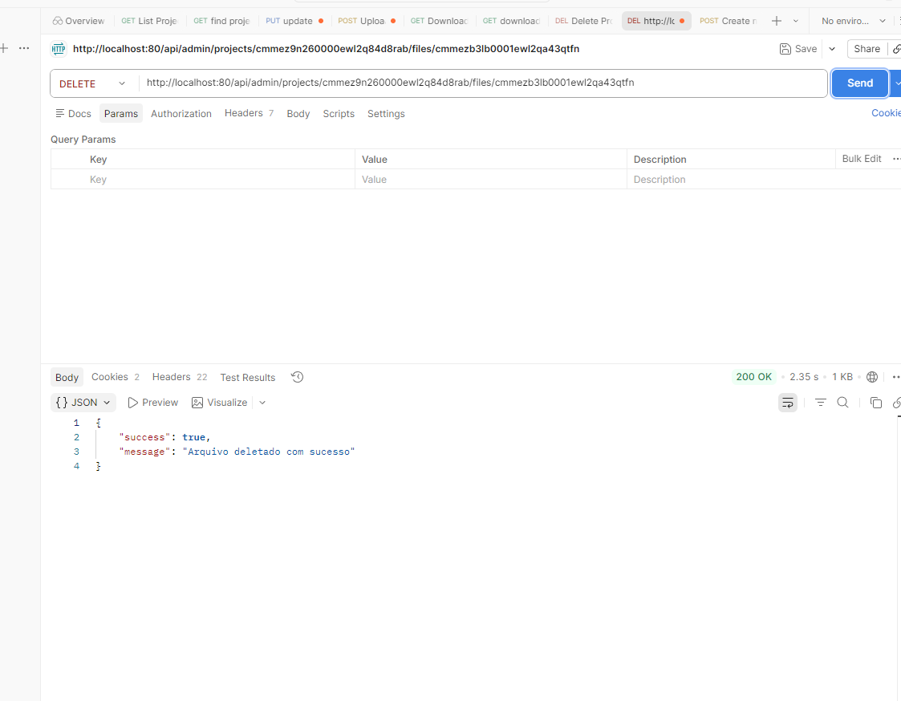
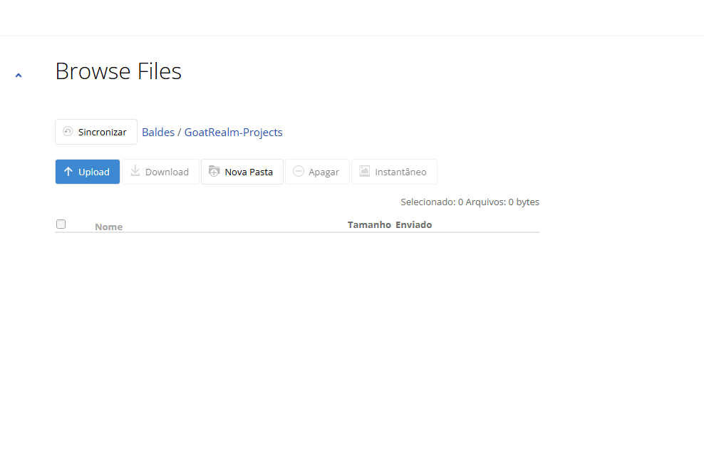

# User

## get personal projects (USER)

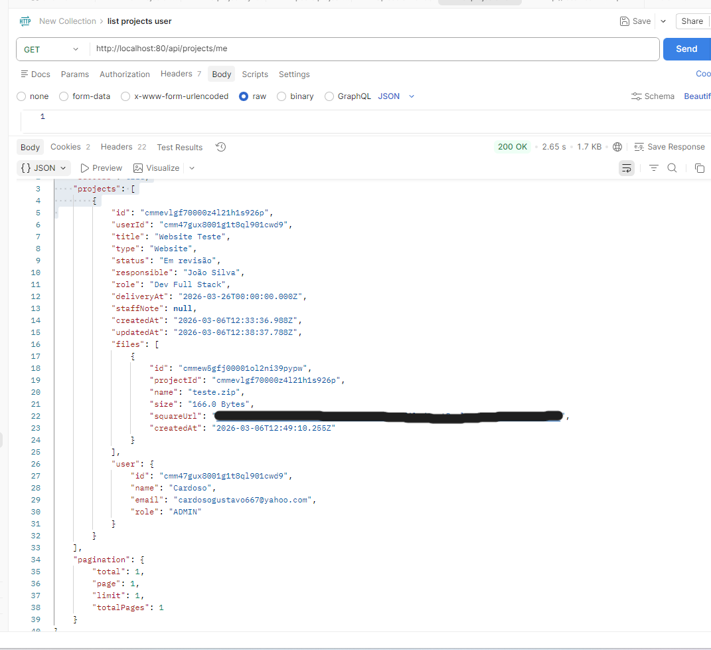

## user download personal project

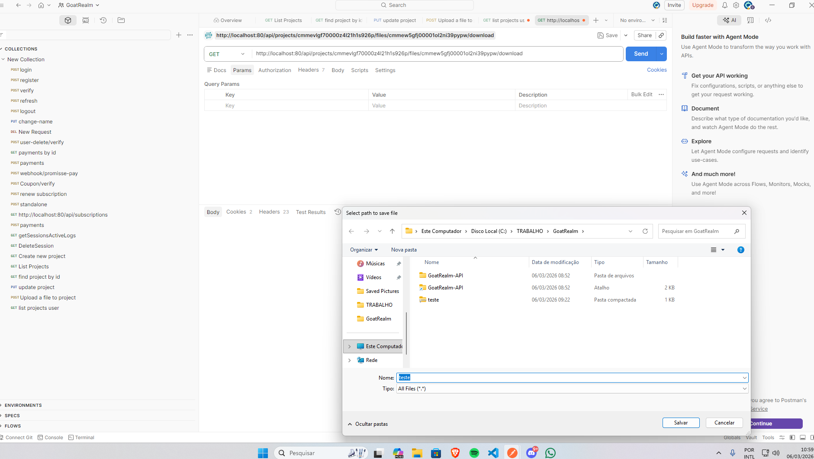
